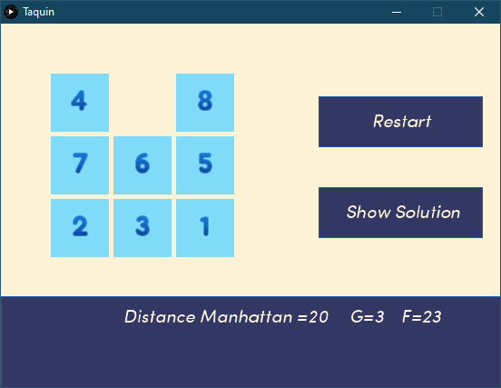
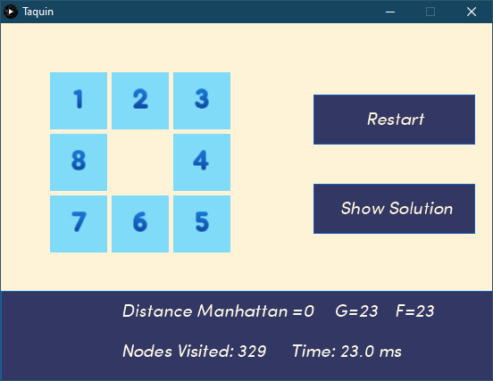

# Game of Taquin with processing 
 a 9-puzzle game solver created with processing 3

#Description

the solver will attempt to solve the puzzle using the A* search algorithm.

 

The manhattan distance is claculated between the current state of the game and the solution 

Once the solver finds a path towards a solution, the number of nodes visited by the A* algorithm is shown
 
 

